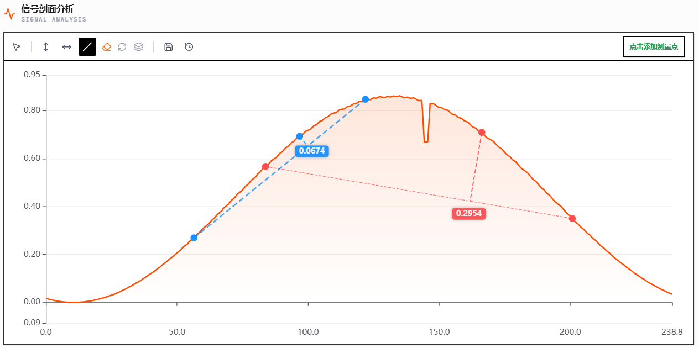
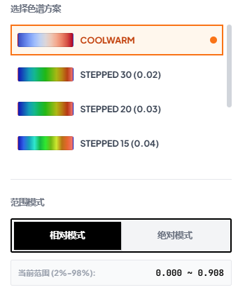

# Surface Inspector Pro v3.3 更新报告 (Update Report)

**版本号：** Pro v3.3  
**更新日期：** 2026-04-25  
**主要领域：** 测量系统重构、自动化配置管理、高级算法增强

---

## 🚀 核心新功能

### 1. 测量预设系统 (Measurement Presets)
新增**测量配置管理中心**。支持将当前的 2D 选区（Box/Line）、测量模式、物理基准及分析结果保存为“快照方案”。
- **一键切换：** 面对不同产品检测逻辑可瞬间切换，无需手动重复拉取区域。
- **自动适配：** 切换不同数据源时，测量点位将根据物理坐标自动“吸附”并重算，确保分析的一致性。
- **配置持久化：** 支持预设重命名、设为默认及导出/导入。

### 2. 多基准线点到线测量 (Multi-Baseline P2L)
点到线测量工具升级为**多组并行管理模式**。支持在同一波形图中建立多个测量组，每组拥有独立的基准线和颜色标识。

- **可视化结果：** 图表中通过彩色投影线实时展示各测点到对应基准线的垂直距离，直观展示多台阶形貌对比。

### 3. 衍生形貌分析模式 (Gradient & Curvature Maps)
系统现已支持全自动的形貌分析转换，可一键将原始高度图转换为 X/Y 方向的梯度图与曲率图，直观展现微观形貌特征。
- **高度图 (Height Map)：** 展示全局起伏。
- **梯度图 (Gradient Map)：** 捕捉表面斜率变化，突出边缘与台阶。
- **曲率图 (Curvature Map)：** 敏锐识别表面微观缺陷、划痕或应力集中点。

### 4. 色谱显示算法优化 (Color Palette Pro)
针对工业测量中的噪声干扰，对色谱映射进行了深度优化：
- **百分位边界：** 在“相对模式”下，自动锁定 **2% 与 98% 分位数**作为色谱边界，彻底解决极少数噪声点导致全图颜色饱和的问题。

- **色谱预设：** 支持保存“配色+范围”组合配置，针对不同材质（如金属、陶瓷）一键切换最佳对比度配色方案。支持 Coolwarm、Stepped 等多种工业色谱一键应用。

---

## 🎨 UI/UX 深度升级

### 1. 工业级视觉美学
界面采用 **Plus Jakarta Sans** 与 **JetBrains Mono** 字体组合，营造专业性。
- **磨砂玻璃效果 (Glassmorphism)：** 悬浮面板采用毛玻璃材质，提升层级感。
- **精细化交互：** 增加 Shimmer 流光效果、打字机动画、以及平滑的面板推拉动效。

### 2. 操作体验优化
- **'T' 键极速拾取：** 鼠标随动时按下 T 键，瞬间锁定目标点物理数据。
- **划线测量：** 从“拖动”优化为“两点点击”逻辑，定位更精准。

---

## 🔧 问题修复与稳定性

- **显示一致性：** 修复了切换视图模式时 Tooltip 数据显示不同步的逻辑错误。
- **性能优化：** 2D 画布渲染管线优化，大幅降低大尺寸点云数据下的 CPU 占用。
